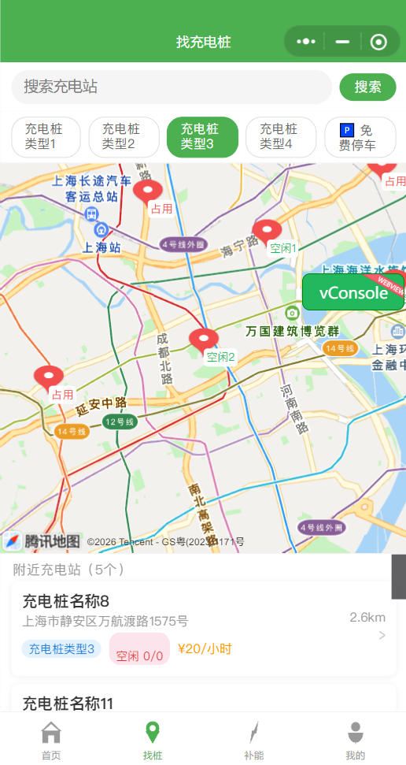
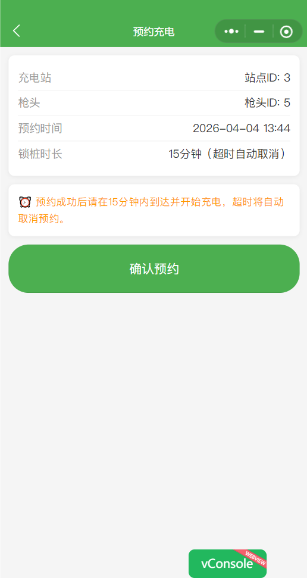
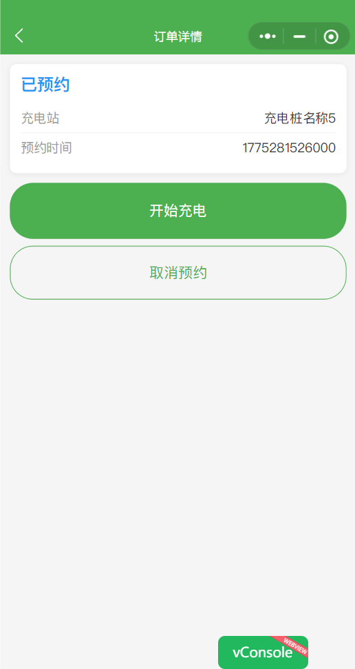
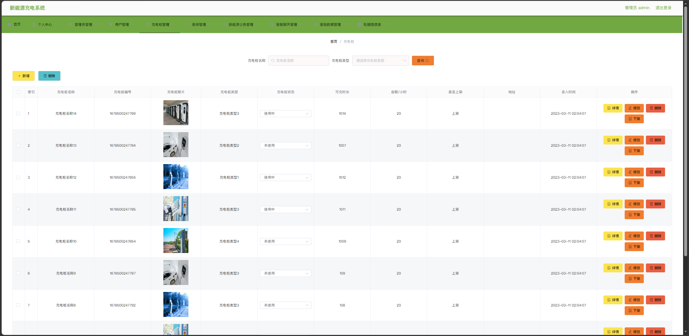
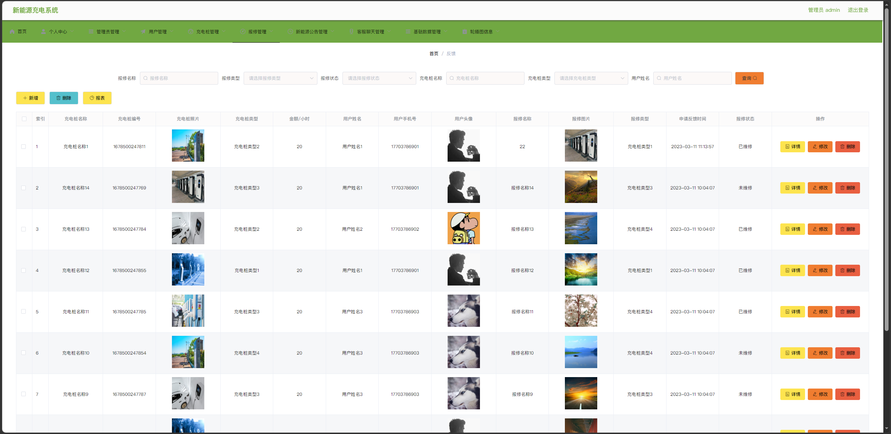
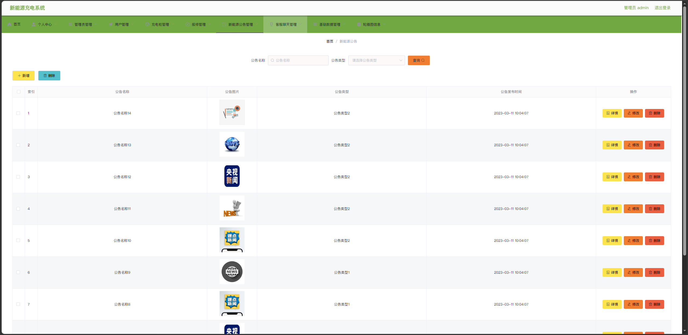
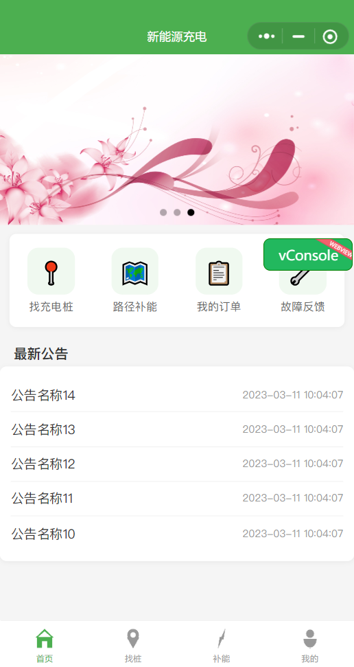

# Energy 新能源充电系统

本仓库包含后台服务、管理端前端与微信小程序源码。

## 目录说明

| 目录 | 说明 |
|------|------|
| `back/` | Spring Boot 后端、小程序源码 `miniprogram/`、数据库脚本 `db/` |
| `admin_view/` | Vue 管理后台 |

## 远程仓库

> 后台地址：`http://localhost:8080/xinnengyuanchongdainxitong/admin/index.html#/index/`  

## 本地运行

- 后端：进入 `back/`，配置 `application.yml` 中数据库与 Redis，执行 Maven 构建运行。
- 管理端：进入 `admin_view/`，`npm install` 后 `npm run serve`。
- 若需将管理端打包进后端静态目录：在 `admin_view/` 执行 `npm run build`，将生成目录拷贝到 `back/src/main/resources/admin/admin/`。
- 小程序：使用微信开发者工具打开 `back/miniprogram/`。

程序截图

